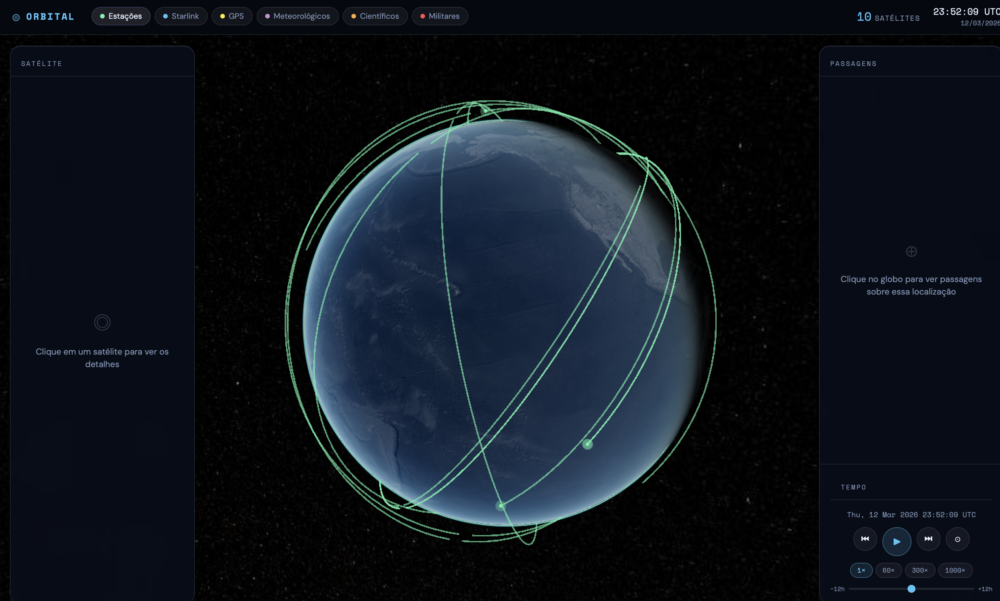

# ORBITAL — Satellite Tracker



Rastreador de satélites em tempo real com globo 3D interativo. Visualize posições, órbitas e passagens de satélites ao redor da Terra, com dados TLE atualizados a cada 30 minutos.

---

## Funcionalidades

### Globo 3D
- Renderização com **CesiumJS** — globo interativo com rotação, zoom e pan
- Textura base NaturalEarthII (offline, carregamento instantâneo)
- Textura de detalhe **Esri World Imagery** — tiles de satélite de alta resolução que carregam progressivamente conforme o zoom
- Skybox com estrelas reais (catálogo Tycho2)
- Atmosfera simulada com efeito de borda iluminada

### Satélites
- **6 categorias**: Estações Espaciais (ISS), Starlink, GPS, Meteorológicos (NOAA), Científicos (Sentinel), Militares (Cosmos)
- Até **100 satélites por categoria**, renderizados como pontos coloridos por tipo
- Propagação orbital em tempo real via algoritmo **SGP4** (satellite.js)
- **Trilha orbital**: ao selecionar um satélite, exibe a trajetória calculada em arco na superfície do globo
- Cache local (localStorage) com TTL de 30 minutos — evita requisições repetidas à API

### Painel de Satélites
- Lista todos os satélites carregados da categoria ativa
- Clique em um satélite na lista ou no globo para abrir o painel de detalhes
- **Painel de detalhes** exibe: altitude, velocidade, inclinação, período orbital e imagem buscada na NASA Image API
- Indicador de contagem total no header do painel
- Painel colapsável — minimiza para o header

### Busca por País
- Campo de busca com autocomplete para ~90 países
- Ao selecionar: câmera voa até o país, fronteira é destacada em ciano
- Fronteiras carregadas via **TopoJSON** (world-atlas 110m, CDN)

### Controle de Tempo
- **Play/Pause** da simulação
- Retroceder e avançar 1 hora
- Velocidades: **1×, 60×, 300×, 1000×**
- Slider de timeline: ±12 horas em relação ao momento atual
- Relógio UTC em tempo real no header

### Design System
- Tema HUD espacial: fundo escuro, fonte **Space Mono**, cor de acento ciano `#4fc3f7`
- Bordas sem arredondamento (`border-radius: 0`), marcadores de canto em painéis
- Painéis independentes e colapsáveis com título à esquerda e ações à direita
- Font size mínimo de 12px em toda a interface

---

## Stack

| Biblioteca | Versão | Uso |
|---|---|---|
| [CesiumJS](https://cesium.com/) | ^1.125 | Renderização do globo 3D, câmera, entidades |
| [satellite.js](https://github.com/shashwatak/satellite-js) | ^5.0 | Propagação orbital SGP4/SDP4 a partir de TLE |
| [topojson-client](https://github.com/topojson/topojson-client) | ^3.1 | Conversão de TopoJSON para GeoJSON (fronteiras) |
| [Vite](https://vitejs.dev/) | ^6.0 | Build tool + dev server com proxy |
| [vite-plugin-cesium](https://github.com/nshen/vite-plugin-cesium) | ^1.2 | Serve assets estáticos do CesiumJS via Vite |

**APIs externas:**
- **TLE API** (`tle.ivanstanojevic.me`) — dados TLE dos satélites (CORS aberto)
- **NASA Images API** (`images-api.nasa.gov`) — imagens dos satélites no painel de detalhes
- **Esri World Imagery** — tiles de mapa de alta resolução (ArcGIS MapServer, sem chave)
- **world-atlas** (jsDelivr CDN) — TopoJSON de fronteiras dos países

---

## Estrutura do Projeto

```
satelite-tracker/
├── index.html              # HTML principal — estrutura dos painéis HUD
├── vite.config.js          # Config do Vite: base path, plugin Cesium, proxy de dev
├── package.json
│
└── src/
    ├── main.js             # Entry point — inicializa todos os módulos e conecta eventos
    ├── style.css           # Design system completo: variáveis, layout, componentes
    │
    ├── globe.js            # Inicializa o Cesium Viewer, camadas de imagem, iluminação
    ├── satellites.js       # Fetch TLE, cache, propagação SGP4, entidades no globo
    ├── filters.js          # Botões de categoria no header (toggle ativo/inativo)
    ├── borders.js          # Destaque de fronteiras via TopoJSON + CesiumJS polylines
    ├── countrySelector.js  # Autocomplete de países + fly-to da câmera
    ├── timeline.js         # Controles de tempo: play/pause, velocidade, slider
    └── ui.js               # Painel de detalhes do satélite: info orbital + NASA image
```

### Fluxo de dados

```
TLE API (tle.ivanstanojevic.me)
    │
    ▼
satellites.js ──► cache localStorage (30min TTL)
    │
    ├── propagação SGP4 a cada frame (satellite.js)
    │       └── atualiza posição lat/lon/alt de cada entidade Cesium
    │
    └── ao selecionar satélite:
            ├── calcula trilha orbital (120 pontos × 60s)
            ├── exibe polyline no globo
            └── ui.js ──► NASA Images API ──► painel de detalhes
```

### Proxy de desenvolvimento

Em dev, o Vite cria um proxy `/tleapi` → `https://tle.ivanstanojevic.me` para contornar restrições do sandbox do browser. Em produção, a requisição vai diretamente à API (que tem `Access-Control-Allow-Origin: *`). Isso é controlado por `import.meta.env.DEV` em `satellites.js`.

---

## Como rodar localmente

```bash
npm install
npm run dev
```

Abrir em: `http://localhost:5173/designlab/satelite-tracker/`

## Build para produção

```bash
npm run build
```

A pasta `dist/` gerada deve ser publicada no caminho configurado em `vite.config.js` (`base: '/designlab/satelite-tracker/'`). Faça upload via FTP de todo o conteúdo de `dist/` para esse diretório no servidor.

---

Built with Claude Code
